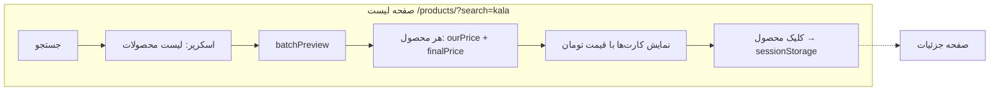
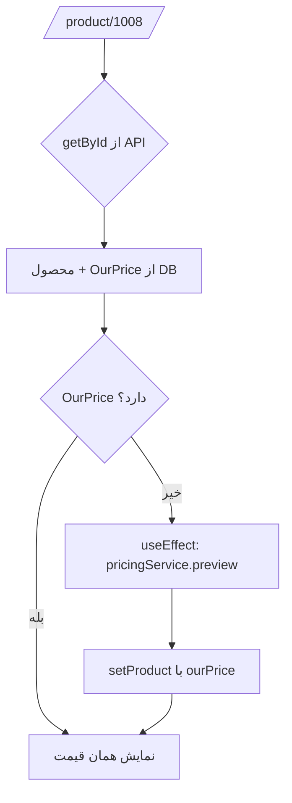
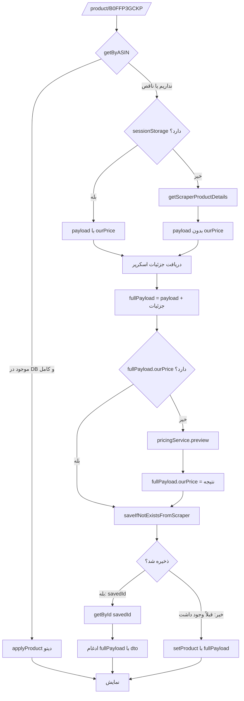
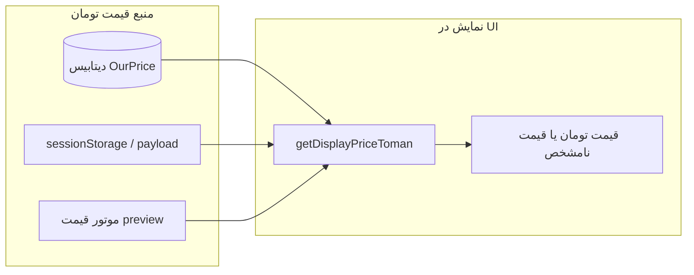

# استراتژی نمایش و ذخیرهٔ قیمت در صفحهٔ جزئیات محصول

---

## جدول خلاصه

| صفحه / مسیر | ورودی | منبع قیمت تومان | ذخیره در DB |
|-------------|--------|------------------|-------------|
| **لیست محصولات** `/products/?search=kala` | جستجو از اسکرپر | `batchPreview` → هر محصول **ourPrice** می‌گیرد | — |
| **جزئیات با ID** `/product/1008/` | شناسه عددی | **getById** → OurPrice از DB؛ اگر نبود → **preview** یک‌بار | قبلاً ذخیره شده |
| **جزئیات با ASIN** `/product/B0FFP3GCKP/` (از لیست) | sessionStorage از کلیک | payload قبلاً **ourPrice** دارد | بعد از لود جزئیات: **preview** اگر نبود → **save** با ourPrice |
| **جزئیات با ASIN** (ورود مستقیم با لینک) | فقط ASIN | اسکرپر + جزئیات → **preview** → **fullPayload.ourPrice** → **save** | بله؛ fullPayload شامل ourPrice + بک‌اند RecalculateAndApplyPricing |

---

## جدول منبع نمایش قیمت (تابع getDisplayPriceToman)

| اولویت | منبع | توضیح |
|--------|------|--------|
| ۱ | **product.ourPrice** یا **product.finalPrice** | از API، sessionStorage، یا payload بعد از preview |
| ۲ | — | اگر نبود → برمی‌گرداند **۰**؛ در UI نمایش **«قیمت نامشخص»** تا preview بیاید |
| ❌ | ~~getBasePrice (current_price)~~ | استفاده **نمی‌شود** برای نمایش تومان (current_price درهم است) |

---

## جریان کاری (ورک‌فلو)

### ۱) صفحهٔ لیست محصولات

### ۲) صفحهٔ جزئیات — ورود با **ID** عددی (مثلاً 1008)

### ۳) صفحهٔ جزئیات — ورود با **ASIN** (مثلاً B0FFP3GCKP)

### ۴) خلاصهٔ یک‌نگاه

---

## توضیح کوتاه

- **getDisplayPriceToman(product)** فقط **ourPrice / finalPrice** را برمی‌گرداند؛ هرگز **current_price** (درهم) را به‌عنوان تومان نشان نمی‌دهد.
- در مسیر **ASIN**، قبل از **saveIfNotExistsFromScraper** اگر ourPrice نباشد حتماً **preview** زده می‌شود تا هم نمایش پایدار باشد هم ذخیره با قیمت انجام شود.
- بک‌اند بعد از ذخیره **RecalculateAndApplyPricingAsync** را صدا می‌زند و OurPrice را در DB می‌نویسد؛ اگر این مرحله خطا بدهد، فرانت همان ourPrice محاسبه‌شده قبل از ذخیره را در dto ادغام می‌کند و کاربر عدد درست را می‌بیند.

> **نکته:** نمودارهای بالا با Mermaid هستند. در VS Code (با افزونه Markdown Preview Mermaid) یا GitHub به‌صورت فلوی واقعی نمایش داده می‌شوند. در غیر این صورت می‌توانی کد هر بلوک را در [mermaid.live](https://mermaid.live) paste کنی و نمودار را ببینی.
